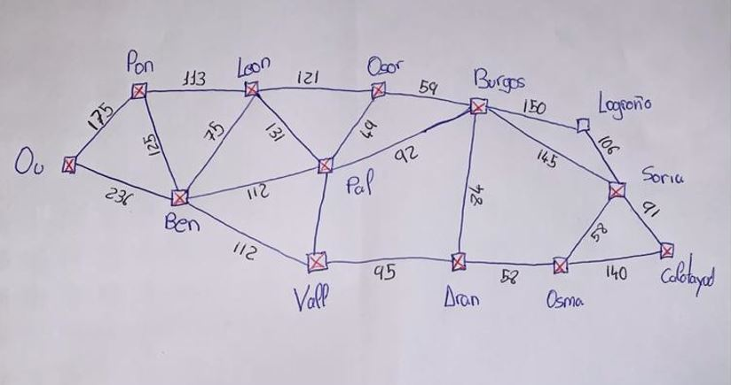
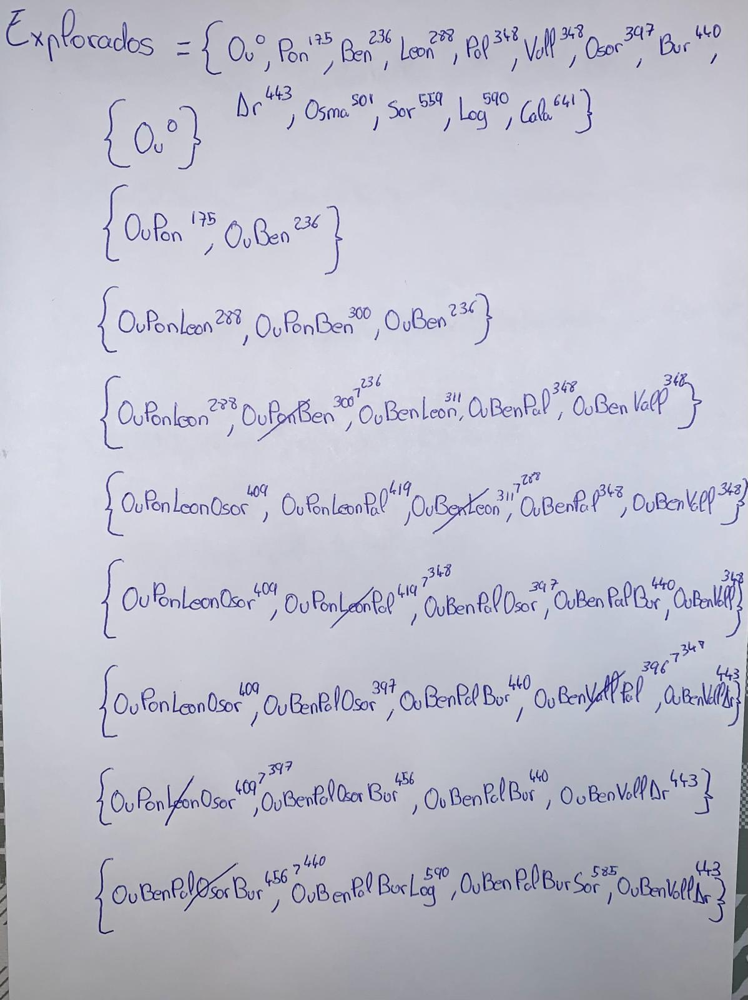
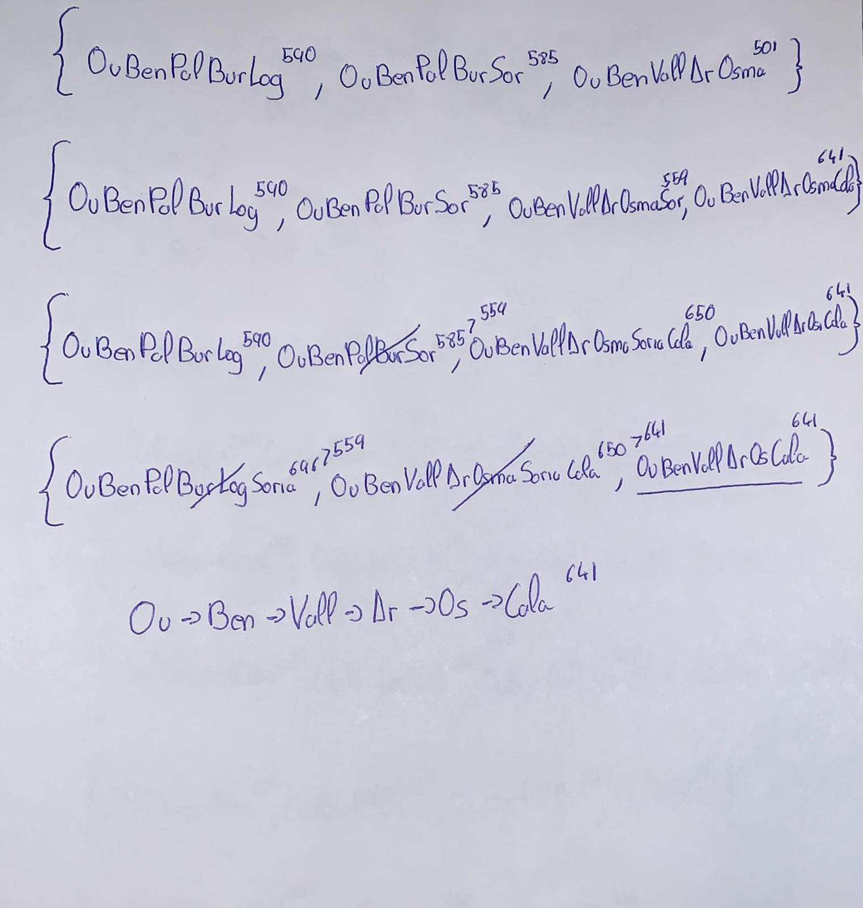

# Algoritmos_de_busqueda
Introducción a los Sistemas Informáticos Inteligentes - Ejercicios

# Ejercicio 4
En el hipotético caso de que el servicio Mapas de Google empleara el algoritmo de **búsqueda por coste uniforme** para encontrar la ruta más corta (en Km) entre dos localidades. 
Calcula la solución que ofrecería para la ruta Ourense-Calatayud dadas las siguientes
distancias kilométricas:

| Origen       | Destino       | Km |
|--------------|---------------|-----------|
| Ourense      | Ponferrada    | 175       |
| Ourense      | Benavente     | 236       |
| Ponferrada   | León          | 113       |
| Ponferrada   | Benavente     | 125       |
| Benavente    | León          | 75        |
| Benavente    | Valladolid    | 112       |
| Benavente    | Palencia      | 112       |
| Palencia     | León          | 131       |
| Palencia     | Valladolid    | 48        |
| Palencia     | Osorno        | 49        |
| Palencia     | Burgos        | 92        |
| León         | Osorno        | 121       |
| Osorno       | Burgos        | 59        |
| Valladolid   | Aranda        | 95        |
| Burgos       | Aranda        | 84        |
| Aranda       | Osma          | 58        |
| Osma         | Calatayud     | 140       |
| Osma         | Soria         | 58        |
| Burgos       | Soria         | 143       |
| Burgos       | Logroño       | 150       |
| Logroño      | Soria         | 106       |
| Soria        | Calatayud     | 91        |

# Ejercicio NPC (A*)
Ejercicio NPC usando el algoritmo de **A*** del libro: **Grokking Artificial Intelligence Algorithms (Rishal Hurbans)**[pag 69]

/Ejercicio_NPC_(A-star)_tablero.jpg)
/Ejercicio_NPC_(A-star).jpg)
/Ejercicio_NPC_(A-star)_solucion_final.jpg)
